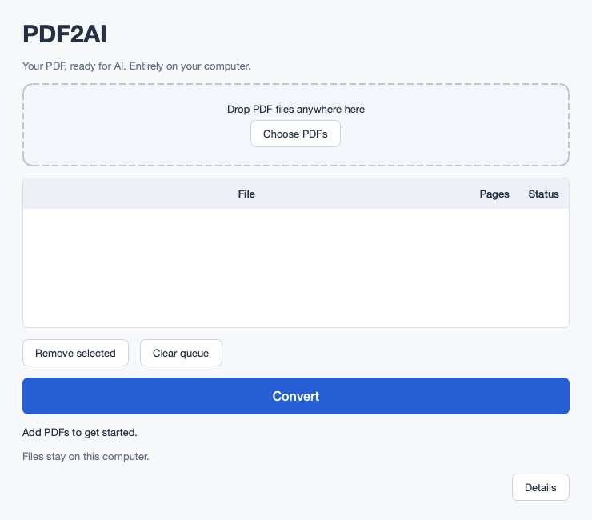

# PDF2AI

A small local desktop utility that converts each PDF into one `.ai.md` file using
PyMuPDF4LLM and its modern Layout engine. Upload the resulting Markdown to your
preferred LLM yourself. PDF2AI does not summarize, rewrite, or remove legal text.



## Use

1. Start PDF2AI, then drop PDFs onto the window or click **Choose PDFs**.
2. Set your **Output Folder** — defaults to `Documents\PDF2AI Output` on first
   run. Click **Browse…** to choose a different location. Your choice is saved
   and restored each time you open PDF2AI.
3. Click **Convert**. Documents run sequentially in a separate local process.
4. Click **Open Output Folder** to open the folder immediately in Explorer.
   Each file's full output path also appears under **Details**.

Select queue rows to remove them, or clear the queue. Completed files are not
converted again unless you remove and re-add them. Failed files can be retried.
**Stop after current PDF** finishes the current document before stopping; closing
while busy offers the same safe behavior. A long OCR document may take minutes.

Default output location:

```text
C:\Users\YourName\Documents\PDF2AI Output\policy.ai.md
C:\Users\YourName\Documents\PDF2AI Output\policy.ai (2).md  (if the first exists)
```

```markdown
<!-- PDF2AI
Source: policy.pdf
Pages: 287
Generated locally by PDF2AI
-->

<!-- PAGE 1 -->

[The extraction engine's Markdown text]

<!-- PAGE 2 -->
```
## Development

Use 64-bit Python 3.13, the version used for verification. The project permits
Python 3.11–3.14; those interpreter versions have not been tested here.
From this repository in Windows PowerShell:

```powershell
python -m venv .venv
.\.venv\Scripts\Activate.ps1
python -m pip install -U pip
pip install -e ".[dev]"
python -m pdf2ai
pytest -q
```

On macOS/Linux use `source .venv/bin/activate` instead. After setup,
`scripts\run_dev.bat` launches the Windows GUI without a terminal. Tests generate
small PDF fixtures at runtime; no large PDFs are committed. Integration tests
exercise the actual native extraction, local OCR and spawned GUI worker.

## Windows distribution

### End-user installation

End users receive a single file: **`PDF2AI-Setup.exe`**.

1. Double-click `PDF2AI-Setup.exe`.
2. Follow the installer wizard (no administrator rights required).
3. Launch PDF2AI from the Desktop shortcut or Start Menu.

The installer is completely self-contained. No Python, no configuration, no
command-line tools are needed on the target PC. To uninstall, go to
**Windows Settings → Apps → Installed apps → PDF2AI → Uninstall**.

### Developer release build

Build on **64-bit Windows**, with Python 3.13 on the build machine.
You also need **Inno Setup 6** installed on the build machine —
download from <https://jrsoftware.org/isdl.php>.

Run the full release build with one command:

```bat
scripts\build_release_windows.bat
```

This script performs, in order:

1. Verifies 64-bit Python.
2. Creates/updates the `.venv` virtual environment.
3. Installs pinned `[dev,build]` dependencies.
4. Runs `pytest -q` — fails the build if any test fails.
5. Runs PyInstaller + the packaged smoke test (`--self-test`) via
   `scripts\build.py` — fails the build if the smoke test fails.
6. Locates `ISCC.exe` (Inno Setup compiler); prints clear install
   instructions and fails if Inno Setup is not found.
7. Compiles `installer\PDF2AI.iss` and verifies the output.

Final artifact:

```
release\PDF2AI-Setup.exe
```

For a PyInstaller-only build without the installer (developer iteration):

```bat
scripts\build_windows.bat
```

PyInstaller is used because it collects the existing native wheels and model
files directly using Qt/ONNX hooks. This was successfully packaged and tested
locally. Qt's official Nuitka route was investigated and reached C compilation,
but compiling the large generated PyMuPDF wrappers was substantially more
expensive without helping extraction fidelity. No incompatibility is claimed.
The alternative configuration is retained in `pysidedeploy.spec`; developers
can run `python scripts/build_qt.py` to build with pyside6-deploy / Nuitka 4.2.1
(a supported C/C++ toolchain is required). The default build avoids that extra
compiler requirement.

ONNX Runtime may require the Microsoft Visual C++ 2015–2022 x64 runtime on a
clean PC; if the startup check reports unavailable OCR, install that official
runtime and retry.

A packaged local self-test can also be run manually with:
`PDF2AI.exe --self-test C:\Temp\PDF2AI-smoke`; it writes synthetic PDFs,
Markdown, and `PASS.txt` or `FAIL.txt` only in that directory.

---

## Release checklist

Run this sequence on a **clean 64-bit Windows PC or VM where Python is
NOT installed** before any broad distribution.

1. Copy `release\PDF2AI-Setup.exe` to the clean machine.
2. Double-click `PDF2AI-Setup.exe`. Complete installation through the
   wizard. Do not open PowerShell at any point.
3. Launch PDF2AI from the Desktop shortcut.
4. Confirm the GUI starts with no error dialogs.
5. Confirm the **Output Folder** row shows the default
   `Documents\PDF2AI Output` path.
6. Click **Browse…** and choose a different folder (e.g. `Desktop\Test Out`).
7. Add a normal text-based PDF. Click **Convert**.
8. Add a scanned/image-based PDF. Click **Convert** (or re-run all).
9. Click **Open Output Folder** and verify:
   - Both `.ai.md` files are present in the chosen folder.
   - Each contains `<!-- PAGE 1 -->` markers.
   - The scanned PDF's output contains readable text (not garbled).
10. Close and reopen PDF2AI. Confirm the **Output Folder** field
    still shows the folder you chose in step 6 (QSettings persistence).
11. Go to **Windows Settings → Apps → Installed apps → PDF2AI → Uninstall**.
    Confirm PDF2AI uninstalls cleanly.
    Confirm the generated `.ai.md` files in the output folder are untouched.

---

## Windows security / signing

### SmartScreen warning (unsigned installer)

An unsigned `PDF2AI-Setup.exe` will trigger a **Windows SmartScreen** or
"Unknown publisher" warning on first run. This is expected and normal for
any unsigned installer. The user must click **More info → Run anyway**.

Do **not** attempt to bypass or suppress SmartScreen warnings. They are a
Windows security feature.

### Optional: code-signing certificate

For professional distribution, adding a code-signing certificate suppresses
the SmartScreen warning and displays the publisher name in the UAC dialog.
To add signing to the build:

1. Obtain an EV or OV code-signing certificate from a trusted CA
   (e.g. DigiCert, Sectigo, GlobalSign).
2. After `ISCC.exe` produces `release\PDF2AI-Setup.exe`, add a signing step
   to `scripts\build_release_windows.bat`:

   ```bat
   signtool sign /fd SHA256 /tr http://timestamp.digicert.com /td sha256 ^
       /f path\to\certificate.pfx /p YourPassword ^
       release\PDF2AI-Setup.exe
   ```

3. You may also sign the inner `dist\PDF2AI\PDF2AI.exe` before running
   Inno Setup, so both the installer and the installed executable are signed.

Code signing is **not required** for development or internal testing.
Do not add signing as a blocker for initial releases.

## Extraction and OCR

Pinned and inspected: PyMuPDF4LLM / PyMuPDF / Layout 1.28.2, RapidOCR 3.9.2,
ONNX Runtime 1.29.0, PySide6 6.11.2. One whole-document `to_markdown()` call uses
`page_chunks=True`, `header=True`, `footer=True`, `force_text=True`,
`use_ocr=True`, `force_ocr=False`, and disables written/embedded images. Page
chunks are ordered by their 1-based metadata. No legacy extraction fallback.

The official `pymupdf4llm.ocr.rapidocr_api.exec_ocr` adapter selects the modern
RapidOCR backend. Its bundled ONNX models are checked with tiny-image inference
at startup. Selective OCR preserves healthy native text. The installed Layout
wrapper's default OCR resolution is **150 DPI**, left unchanged. The legacy
`fontsize_limit` option is not supported by Layout and is intentionally not
passed; actual 4-point native text is covered by regression tests.

If OCR is unavailable, native extraction remains usable, the window warns that
scanned pages cannot be recognized, and every output is marked for review.
Missing, duplicate and nearly empty page chunks trigger **Done — review
suggested** with page numbers in Details. Output is retained. These checks are
not an OCR confidence score or a guarantee of correctness.

## Limitations

Always review critical policy/legal wording against the PDF. OCR can miss or
misread tiny, blurred, rotated, handwritten or unsupported-language text.
Complex/multi-page tables and unusual reading order can be imperfect. Pictures
and diagrams are not exported; text retained by the extraction engine is.
Blank pages are intentionally reported for review. Password-protected PDFs
require an unlocked copy. Whole-document extraction uses memory proportional to
the document; 300-page image-heavy files can be slow. Stop is document-boundary
cancellation, not immediate interruption. Disk-backed filesystems must support
atomic rename (Windows) or hard links (POSIX); unsupported filesystems produce a
save error rather than risk overwriting output.

See `THIRD_PARTY_NOTICES.md` for dependency licenses and official API references.
See `BUILD_VALIDATION.md` for the checks actually run and platform limitations.
